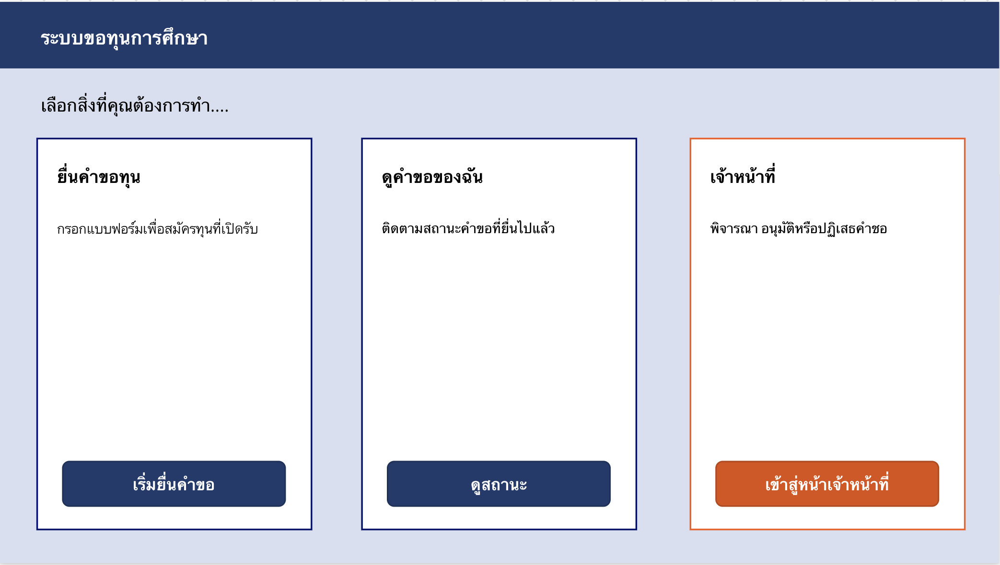
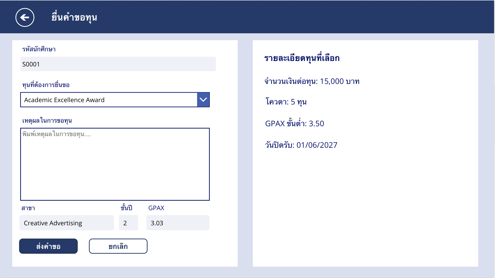
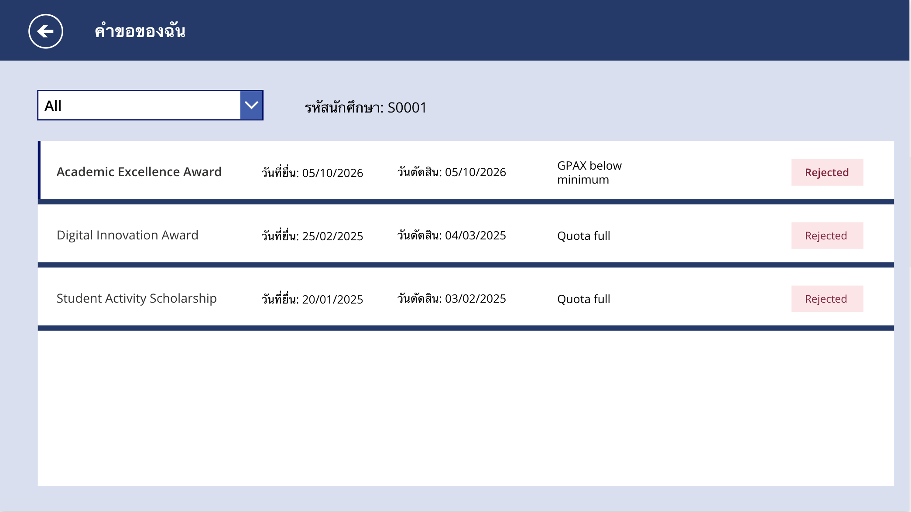
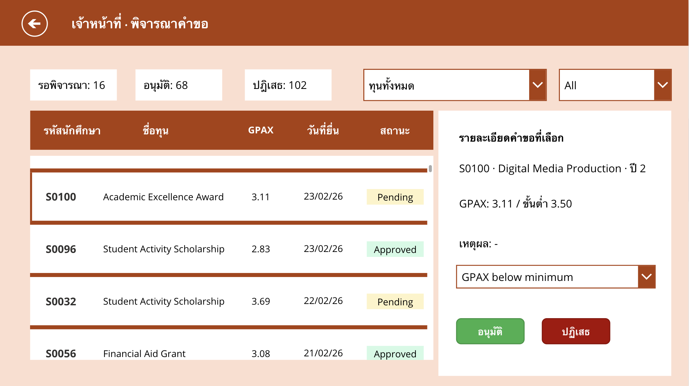

# Scholarship Application Prototype

A self-study low-code application built with Microsoft Power Platform to explore business application development and workflow automation.

## Technologies

* Microsoft Power Apps
* Microsoft Power Automate
* SharePoint Lists
* Simulated data

## Overview

This project recreates a scholarship application workflow from a previous web development project using Microsoft Power Platform.

The prototype supports two types of users:

* **Students:** Submit scholarship applications and track application status.
* **Staff:** Review applications and approve or reject requests.

## Key Features

### Power Apps

* Scholarship application form for students
* Application status tracking
* Staff application review
* Duplicate application checks
* Approval quota checks

### Power Automate

* Notify staff when a new application is submitted
* Notify students when an application is approved or rejected

## Workflow

```text
Student submits application
          ↓
     Duplicate check
          ↓
     Staff review
          ↓
    Approve / Reject
       ↙       ↘
   Student     Student
   notified    notified
```

## Screenshots
### Home


### Student Application



### Application Status



### Staff Review



### Power Automate Workflow


## Purpose

This project was created as a self-study project to gain hands-on experience with Microsoft Power Apps, Power Automate, and SharePoint Lists, and to understand how low-code tools can be used to implement business workflows.
